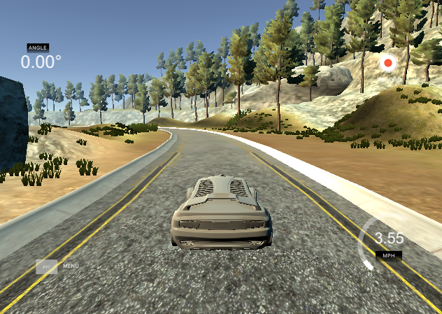

Behavioral Cloning Project
==========================

[](http://www.udacity.com/drive)

Overview
--------

This repository contains files for the Behavioral Cloning Project.

The goal is to train the convolutional neural network to clone driving
behavior, viz. to provide a steering angle as an output based on front
camera input.

Keras framework is used for this project.

Udacity team provided a simulator where the car can be steered a track
for data collection. As a result the image dataset and .csv file with
its description are provided.

This project contains following files: \* model.py (script used to
create the model) \* drive.py (script to drive the car - copied from
Udacity repository. Only model creation part is modified.) \* model.h5
(a trained Keras model) \* weights.h5 (saved model weights) \* README.md
(a report markdown writeup file) \* video.mp4 (a video recording of your
vehicle driving autonomously around the track for one full lap)

The Project
-----------

The steps of this project are the following: \* Use the simulator to
collect data of good driving behavior, \* Build, a convolution neural
network in Keras that predicts steering angles from images, \* Train and
validate the model with a training and validation set, \* Test that the
model successfully drives around track one without leaving the road, \*
Summarize the results with a written report.

### Dependencies

This model training was done using:

-   Python 3.6,
-   Tensorflow 1.5.0,
-   Keras 2.2.4,
-   h5py 2.9.0

Also following packages were used:

-   numpy 1.14.1
-   opencv 4.1.0.25

The model was trained on Windows. When the final model was loaded into
the Udacity workspace, segmentation fault on load\_model on Linux
appeared. The model was recreated on the target machine by creating the
Sequential model again. Then the weights were loaded in the model.

Details About Files In This Directory
-------------------------------------

### `drive.py`

Usage of `drive.py` requires trained model weights as an h5 file, i.e.
`weights.h5`. `model.py` shall be present in the same repository as
`drive.py`. The model is recreated in `drive.py` by creating the
Sequential model again. Then the weights are loaded in the model.

`drive.py` can be lauched using this command:

``` sh
python drive.py weights.h5
```

The above command will load the trained model and use the model to make
predictions on individual images in real-time and send the predicted
angle back to the server via a websocket connection.

#### Saving a video of the autonomous agent

``` sh
python drive.py weights.h5 run1
```

The fourth argument, `run1`, is the directory in which to save the
images seen by the agent. If the directory already exists, it'll be
overwritten.

``` sh
ls run1

[2017-01-09 16:10:23 EST]  12KiB 2017_01_09_21_10_23_424.jpg
[2017-01-09 16:10:23 EST]  12KiB 2017_01_09_21_10_23_451.jpg
[2017-01-09 16:10:23 EST]  12KiB 2017_01_09_21_10_23_477.jpg
...
```

The image file name is a timestamp of when the image was seen. This
information is used by `video.py` to create a chronological video of the
agent driving.

### `video.py`

``` sh
python video.py run1
```

Creates a video based on images found in the `run1` directory. The name
of the video will be the name of the directory followed by `'.mp4'`, so,
in this case the video will be `run1.mp4`.

Optionally, one can specify the FPS (frames per second) of the video:

``` sh
python video.py run1 --fps 48
```

Will run the video at 48 FPS. The default FPS is 60.

### `data_reader.py`

``` sh
python data_reader.py
```

Launches test for DataReader class. This class contains parameters of
expected data set, provides functionality for reading .csv files
containing dataset description, form training and validation sets and
read images using generator. Training images are loaded in BGR
colorspace using cv2, then converted to YUV color space.

### `main.py`

``` sh
python main.py
```

Uses DataReader from `data_reader.py` and BehavioralCloneModel from
`model.py` classes. Train and save the model. Also save model's weights.
Plots the training and validation loss for each epoch.

Collect training data
---------------------

Data were collected using the Simulator provided by Udacity.



Simulator provides images from front, left and right cameras. Also
steering angle corresponding to the center image is written into .csv
file. Angle for left and right camera shots is calculated from the
center angle by adding/subtracting the correction angle(=0.2).


During data collection following rules were followed: \* vehicle should
stay in the center of the road as much as possible \* if the car veers
off to the side, it should recover back to center \* driving
counter-clockwise can help the model generalize

Instead of image flipping for data augmentation several additional laps
were done.

Data from the second track might help to generalize the model, however
due to missing devices such as joystick or more sensitive mouse, it was
hard to collect data containing good driving behavior.


In Summary were collected around 12000 image triples. Two laps
clockwise, two laps counter-clockwise, clockwise and counter-clockwise
part lap with recovery behavior examples.

Class DataReader from `data_reader.py` responds for reading .csv files,
loading images, converting them to YUV color space, generating train and
validation datasets.

DataReader function `read_using_generator` expects paths to folders
which contains driving\_log.csv file and folder with name `IMG`, where
all images from cameras are stored.

Python generator is used for reading images since it yields out data a
single chunk at a time irrespective of the size of the input stream.

Model architecture
------------------

The chosen model architecture was inspired by the following article:
<a href="https://electronicsforu.com/market-verticals/automotive/convolutional-neural-networks-autonomous-cars-part-1-2" class="uri">https://electronicsforu.com/market-verticals/automotive/convolutional-neural-networks-autonomous-cars-part-1-2</a>

However the recommended architecture was modified in order to speed up
the learning process on small performance machine.


| Layer            | Description                                                       |
|------------------|-------------------------------------------------------------------|
| Input            | 3@160x320 YUV image                                               |
| Cropping2D       | Top crop = 60, bottom crop = 20. Output 3@80x320                  |
| Lambda           | Normalization: centered around zero with small standard deviation |
| Conv2D 5x5       | 1x1 stride, 'VALID' padding, output 24@76x316, Leaky ReLU         |
| MaxPooling2D 2x2 | 'VALID' padding, output 24@38x158                                 |
| Conv2D 5x5       | 1x1 stride, 'VALID' padding, output 36@34x154, Leaky ReLU         |
| MaxPooling2D 2x2 | 'VALID' padding, output 36@17x77                                  |
| Conv2D 5x5       | 1x1 stride, 'VALID' padding, output 48@13x73, Leaky ReLU          |
| MaxPooling2D 2x2 | 'VALID' padding, output 48@6x36                                   |
| Conv2D 3x3       | 1x1 stride, 'VALID' padding, output 64@4x34, Leaky ReLU           |
| MaxPooling2D 2x2 | 'VALID' padding, output 64@2x17                                   |
| Fully connected  | input 2176, output 100, Leaky ReLU                                |
| Fully connected  | input 100, output 50, Leaky ReLU                                  |
| Dropout          | Drop rate 0.5                                                     |
| Fully connected  | input 50, output 10, Leaky ReLU                                   |
| Dropout          | Drop rate 0.5                                                     |
| Fully connected  | input 10, output 1                                                |


The resulting network consists of normalization layer, four convolutional layers, three fully connected layers and a single neuron as an output. 

Between convolutional layers are max pooling layers. MaxPooling layers not only help to prevent computational costs, but also prevent **over-fitting**.

Dropout layers also helps to avoid **over-fitting**. 

It's important to have such layers in the network hence 36000 samples is closer to the small training dataset than to the big one. 

The Mean Squared Error loss is the default loss to use for regression problems.
So it was decided to leave it unchanged.

As an optimizer the Adam optimization algorithm is used. It is an extension to stochastic gradient descent and one of the most used optimization algorithms.

Training is performed in 5 epochs.

## The original architecture

The original proposed architecture from the article with 5 convolutional layers and
without max pooling layers in between was also tested. 


Dropout layers were added between first and second fully connected layers to prevent over-fitting.


Train and validation results
----------------------------


Conclusion & Reflection
-----------------------
